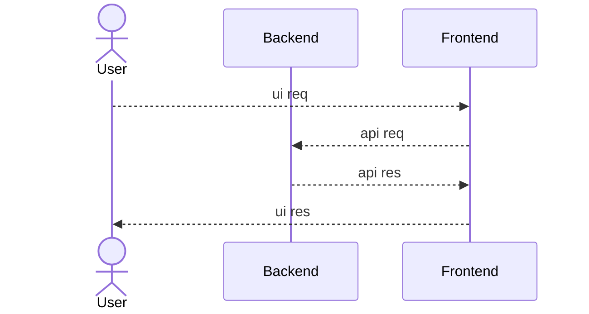
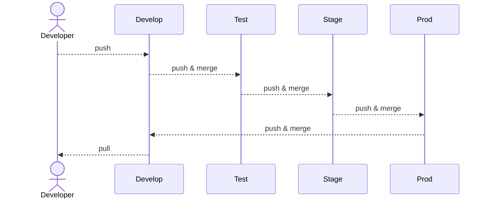
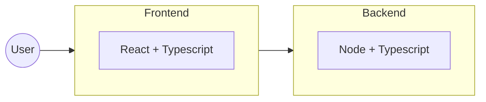

# POC 02 - Express Setup

## System Achitecture

### 01. High Level Design (HLD)

### 02. Low Level Design (LLD)

#### 02.01. Environment Setup

#### 02.02. Project LLD

## Timeline History

### Sprint #01
  - Start - (Date: 18th Sept) - (Time: 02:48 AM)
