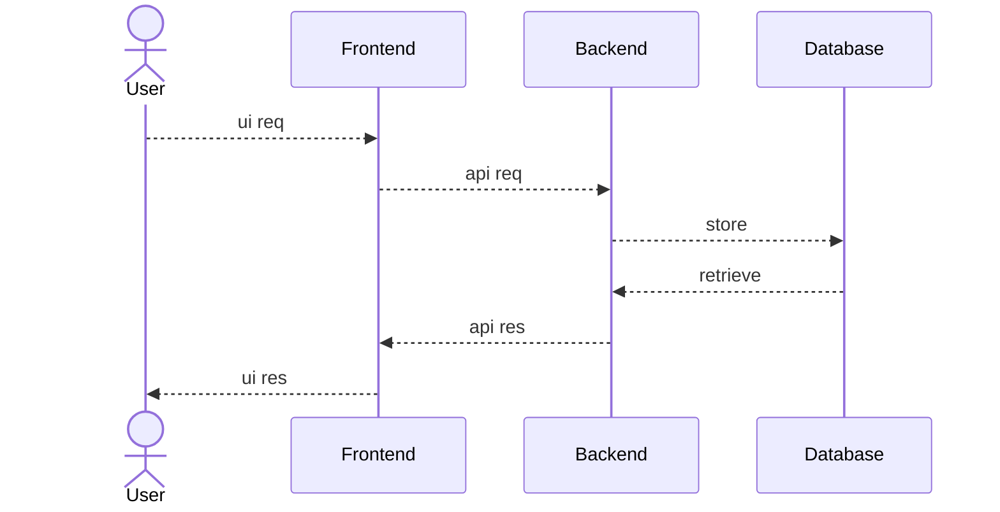
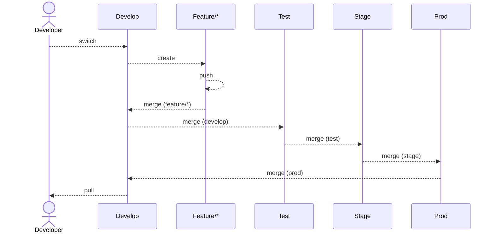
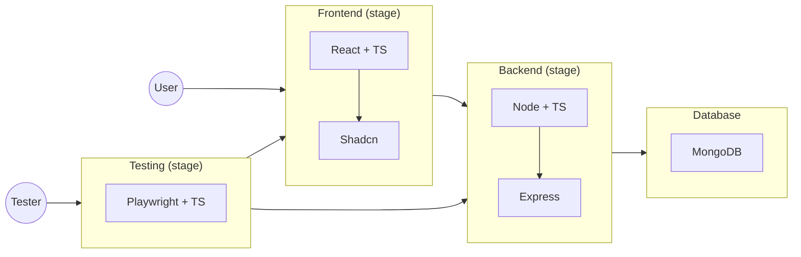
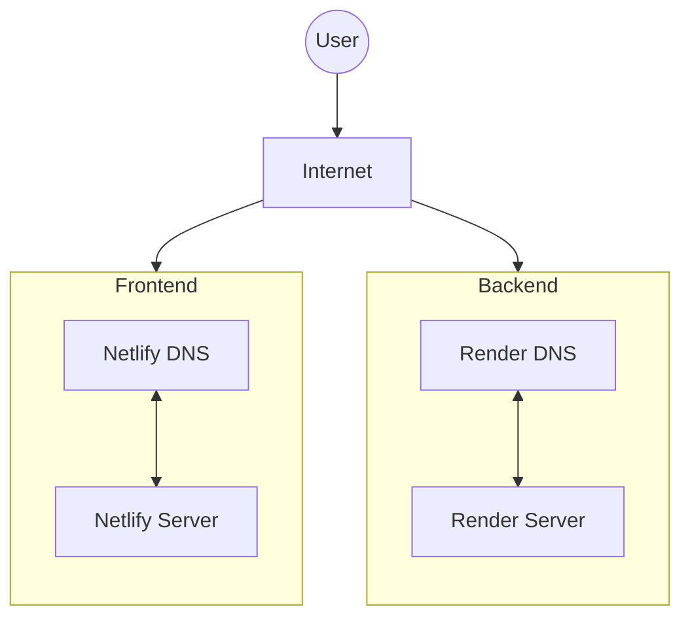
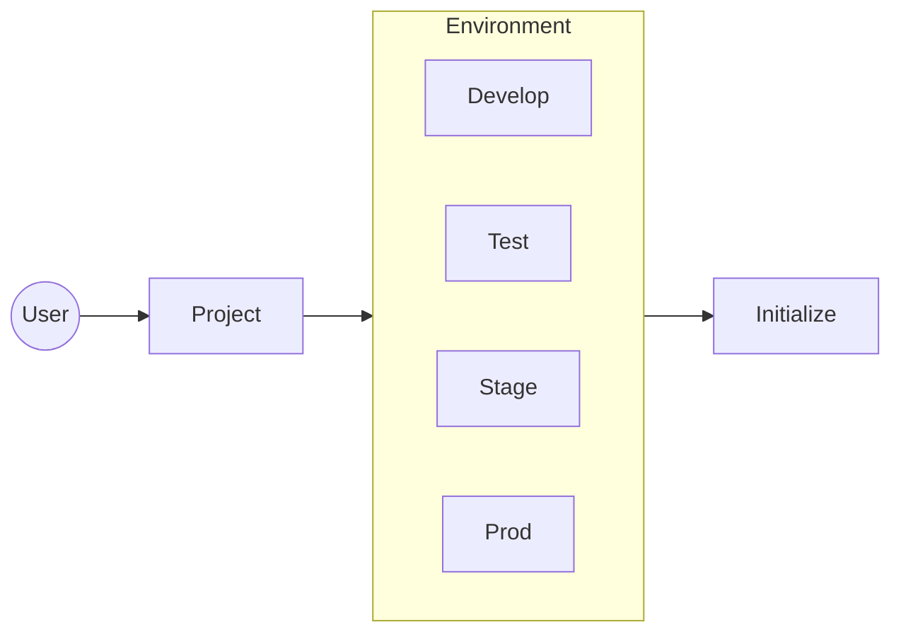

# POC 02 - Express Setup

## System Achitecture

### 01. High Level Design (HLD)

### 02. Low Level Design (LLD)

#### 02.01. Git Branching & PR strategies LLD

#### 02.02. Project LLD

#### 02.03. Servers & DNS LLD

#### 02.04. Environment Setup LLD

## Servers & DNS

### Backend
  - Development
    - Local: [http://localhost:8001/](http://localhost:8001/)
    - Live: [https://express-v01-backend-develop.onrender.com](https://express-v01-backend-develop.onrender.com)
  - Testing
    - Local: [http://localhost:8002/](http://localhost:8002/)
    - Live: [https://express-v01-backend-test.onrender.com](https://express-v01-backend-test.onrender.com)
  - Staging
    - Local: [http://localhost:8003/](http://localhost:8003/)
    - Live: [https://express-v01-backend-stage.onrender.com](https://express-v01-backend-stage.onrender.com)
  - Production
    - Local: [http://localhost:8004/](http://localhost:8004/)
    - Live: [https://express-v01-backend-prod.onrender.com](https://express-v01-backend-prod.onrender.com)

### Frontend
  - Development
    - Local: [http://localhost:3001](http://localhost:3001)
    - Live: [https://express-v01-frontend-develop.netlify.app](https://express-v01-frontend-develop.netlify.app)
  - Testing
    - Local: [http://localhost:3002](http://localhost:3002)
    - Live: [https://express-v01-frontend-test.netlify.app](https://express-v01-frontend-test.netlify.app)
  - Staging
    - Local: [http://localhost:3003](http://localhost:3003)
    - Live: [https://express-v01-frontend-stage.netlify.app](https://express-v01-frontend-stage.netlify.app)
  - Production
    - Local: [http://localhost:3004](http://localhost:3004)
    - Live: [https://express-v01-frontend-prod.netlify.app](https://express-v01-frontend-prod.netlify.app)

### Teesting
  - Report
    - Local: [http://localhost:9323](http://localhost:9323)
    - Live: 

## Timeline History

### Sprint #01
  - Start - (Date: 18th Sept) - (Time: 02:48 AM)
