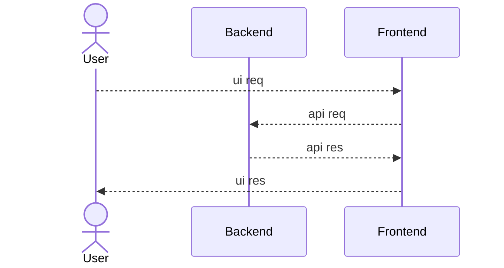
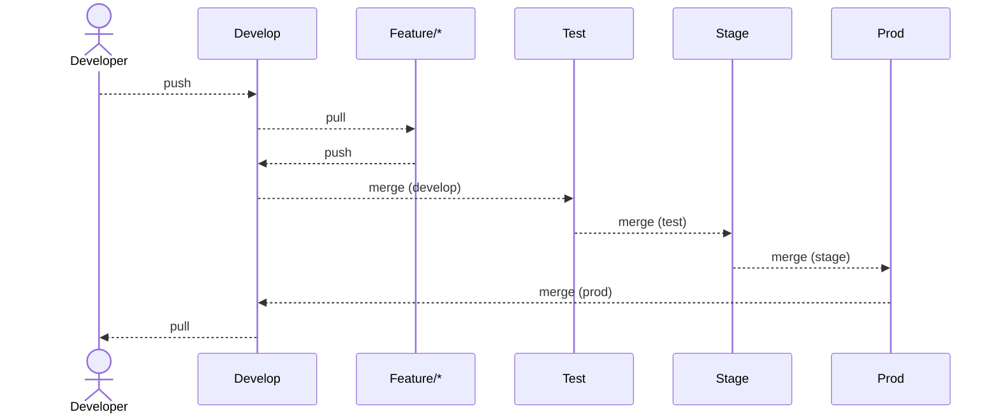
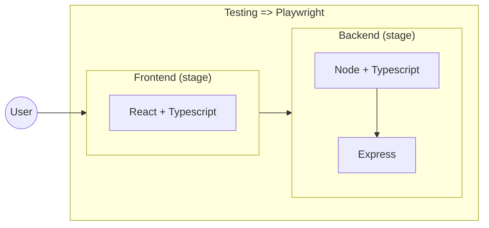

# POC 02 - Express Setup

## System Achitecture

### 01. High Level Design (HLD)

### 02. Low Level Design (LLD)

#### 02.01. Environment Setup

#### 02.02. Project LLD

## Servers & DNS

### Backend
  - Development
    - Local: [http://localhost:8000/](http://localhost:8000/)
    - Live: 
  - Testing
    - Local: [http://localhost:8000/](http://localhost:8000/)
    - Live: 
  - Staging
    - Local: [http://localhost:8000/](http://localhost:8000/)
    - Live: 
  - Production
    - Local: [http://localhost:8000/](http://localhost:8000/)
    - Live: 

### Frontend
  - Development
    - Local: 
    - Live: 
  - Testing
    - Local: 
    - Live: 
  - Staging
    - Local: 
    - Live: 
  - Production
    - Local: 
    - Live: 

### Teesting

## Timeline History

### Sprint #01
  - Start - (Date: 18th Sept) - (Time: 02:48 AM)
